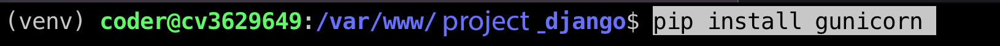

[На главную](/){ .md-button }
##

# Deploy Django project to vps server 

!!! note "пояснения"
    === "Шаги"
        1. Здесь рассматривается запуск проекта на vps сервере разработанного на django со стандартной базой данных sqlite3.
        2. Покупаем сервер и приступаем к его настройке
        3. Поработаем с ssh
        4. Настроим пользователя root
        5. Добавим нового пользователя. Переключимся на него и уже все настройки будем производить через него
        6. Установка и настройка Nginx
        7. Клонируем проект
        8. Установим gunicorn
        9. Установим пакеты для работы с django
    === "ssl"
        1. Научимся подключать к нашему домену ssl сертификат
    === "Полезные видео"
        1. [Настройка сервера для Django 🔥 Git, Nginx, Gunicorn, PostgreSQL, домен, SSL-сертификат](https://www.youtube.com/watch?v=Qvtr7es5dpc)
        2. [Деплой Frontend приложения. Настройка nginx. Подключаем домен, настраиваем HTTPS, gzip, docker](https://www.youtube.com/watch?v=8OHe6chCWTE)
        3. [Настройка веб-сервера Nginx](https://sch9.ru/docs/nginx.html)


---
## #Ресурсные записи -> домен -> сервер
после покупки сервера мы связываем доменное имя с нашим сервером, данные по работе с сервером приходят на указанную вами почту или их можно взять в личном кабинете сервиса в котором покупался сервер


* `настроить ресурсные записи в regru` - Позовлит соединить доменное имя с купленным сервером

заходим в регру, выбираем доменное имя, изменить ресурсные записи, добавляем ip нашего сервера: 

* `в запись @` 
* `и в www`


---
## ssh

### Сгенерировать ключ
```
ssh-keygen -t rsa
```

### Вывести ключ в терминал
```
cat ~/.ssh/id_rsa.pub
```

### Скопировать ключ на удаленный сервер
После ввода команды, введите пароль (не будет отображаться) и нажмите ENTER. Утилита скопирует содержимое открытого ключа (~/.ssh/id_rsa.pub) на удаленный сервер в файл authorized_keys.
```
ssh-copy-id root@00.000.000.000
```

### Если соединение быстро обрывается можно использовать эту команду
```
ssh -o ServerAliveInterval=60 root@00.000.000.000
```

### Зайти на сервер по ssh
```
ssh root@00.000.000.000
```


---

## Обновите список пакетов
    sudo apt update

---


## Учетные записи

### меняем пароль пользователя ROOT
при вво­де сим­волы не отоб­ража­ются — нет ни букв, ни цифр, ни звез­дочек, это нор­маль­но, вве­ди новый пароль и наж­ми Enter
```
passwd
```

---

### добавить учетную запись
следуйте инструкциям, чтобы установить пароль и заполнить другую информацию
```
adduser coder
```

### добавить права суперпользователя для пользователя coder
добавьте пользователя coder в группу sudo, используя команду
```
usermod -aG sudo coder
```

### проверьте, что пользователь добавлен в группу sudo, выполните команду
```
groups coder
```


---
### #Установка программ

### Установите git
* `git --version` - проверить установлен ли git
```
git --version
```

```
sudo apt install git
```

### MCeditor
Midnight Commander — один из файловых менеджеров с текстовым интерфейсом типа Norton Commander для UNIX-подобных операционных
```
sudo apt install mc
```

### Установите Nginx
    sudo apt install nginx

### Полезные команды Nginx
```
sudo nginx -t
```

```
sudo systemctl start nginx
```

```
sudo systemctl restart nginx
```

```
sudo systemctl stop nginx
```

```
sudo service nginx reload
```

```
sudo service nginx status
```

---


### проблема с клонированием / Permission denied
* `Ошибка "Permission denied" при клонировании репозитория Git может возникнуть из-за недостаточных прав доступа к директории, в которую вы пытаетесь склонировать проект. В данном случае, вам не хватает прав на запись в директорию, где вы пытаетесь выполнить клонирование.`
* `Для решения этой проблемы вам следует убедиться, что у вас есть достаточные права доступа к директории /var/www/ или создать новую директорию, куда вы сможете клонировать проект. Вы можете выполнить следующие шаги:`

Убедитесь, что у вас есть права на запись в директорию /var/www/. Для этого выполните команду:
```
ls -ld /var/www/

```

Если у вас нет прав на запись в эту директорию, выполните команду для изменения прав доступа:
```
sudo chmod o+w /var/www/
```

### Убедитесь, что пользователь coder имеет права на запись в директорию /var/www/
Вы можете изменить права доступа с помощью команды
```
sudo chown -R coder:coder /var/www/
```


---
## Склонировать проект 
перейти в папку www
```
cd /var/www/
```
склонировать сюда проект

```
git clone gitLink
```

### проблема с клонированием / Permission denied
* `Ошибка "Permission denied" при клонировании репозитория Git может возникнуть из-за недостаточных прав доступа к директории, в которую вы пытаетесь склонировать проект. В данном случае, вам не хватает прав на запись в директорию, где вы пытаетесь выполнить клонирование.`
* `Для решения этой проблемы вам следует убедиться, что у вас есть достаточные права доступа к директории /var/www/ или создать новую директорию, куда вы сможете клонировать проект. Вы можете выполнить следующие шаги:`

Убедитесь, что у вас есть права на запись в директорию /var/www/. Для этого выполните команду:
```
ls -ld /var/www/

```

Если у вас нет прав на запись в эту директорию, выполните команду для изменения прав доступа:
```
sudo chmod o+w /var/www/
```

----

## Настройка nginx.	Добавить файл в nginx каталог 
(myproject_django - придумайте свой вариант)
```
sudo nano /etc/nginx/sites-available/myproject_django
```

### добавляем в файл /etc/nginx/sites-available/myproject_django эти данные (ставим свой ip в строку server_name)
``` linenums="1"
server {
	
	server_name 00.000.000.000;
	
	location /static/ {
		root '/var/www/myproject_django/';
	}
	
	location /media/ {
		root '/var/www/myproject_django/';
	}
	
	location / {
		include proxy_params;
		proxy_pass http://unix:/run/gunicorn.sock;
	}
}
```

### Создаем симлинк
```
sudo ln -s /etc/nginx/sites-available/myproject_django /etc/nginx/sites-enabled
```

### Перегрузите nginx
```
sudo systemctl restart nginx
```
```
sudo service nginx restart
```

### проверим конфигурацию nginx
```
sudo nginx -t
```

---


## #Django
### Ставим нужные пакеты
* `sudo apt install gcc (python-dev) python3-pip python3-dev curl -y`

```
sudo apt install gcc 
```
```
??? sudo apt install python-dev-is-python3
```
```
sudo apt install python3
```
```
sudo apt install python3-pip
```
```
sudo apt install python3-dev
```
```
sudo apt install curl
```

Проверьте успешность установки с помощью 
```
python3 --version
```


### Установка виртуальной среды Python
```
sudo -H pip3 install --upgrade pip
```
```
sudo pip install --upgrade pip
```
```
sudo -H pip3 install virtualenv
```

### Создайте виртуальную среду в этой директории


!!! Важно
    === "папка вашего проекта"
        1. Убедиться что находимся в папке проекта, например по этому пути  /var/www/django_project
        2. Следующие действия необходимо выполнять в папке вашего проекта
        3. удалить папку venv 

если папка venv не была добавлена в gitignore вполне возможно что она уже будет после клонирования репозитория
```
virtualenv venv
```
### устновим пакет
```
sudo apt install python3.10-venv
```
```
python3 -m venv venv
```
* `python3 -m venv venv` - создание виртуальной среды Python с помощью модуля venv. virtualenv - Это инструмент, который позволяет создавать изолированные среды Python, где каждая среда может иметь свои собственные зависимости и пакеты. venv - Это встроенный модуль Python, начиная с версии 3.3, который также используется для создания виртуальных сред Python. Оба метода - использование python3 -m venv venv и virtualenv venv - позволяют создавать виртуальные среды Python, но различаются в том, как они это делают. Важно отметить, что использование venv является более современным подходом, так как это встроенный инструмент Python, в то время как virtualenv требует установки отдельного пакета.


### Активируйте виртуальную среду
```
source venv/bin/activate
```

### Установка модулей или пакетов вашего django приложения
```
pip install -r requirements.txt
```

### Запуск сервера 
(временная мера - просто для проверки). Ниже настроим gunicorn
```
python manage.py runserver 0.0.0.0:8000
```
```
python3 manage.py runserver 0.0.0.0:8000
```
скорее всего сайт откроется с ошбикой, нужно внести тестовые доступы в settings.py в блок ALLOWED_HOSTS


### Создать папку static 
```
mkdir static
```


### Cобираем статические файлы
```
python manage.py collectstatic
```
```
python3 manage.py collectstatic
```

---


## #Настройка Gunicorn

### в виртуальном окружении выполнить команду (venv)
```
pip install gunicorn
```



### Проверить установился ли gunicorn
```
gunicorn --version
```

### создать файл сокета gunicorn
```
sudo nano /etc/systemd/system/gunicorn.socket
```
```
sudo mcedit /etc/systemd/system/gunicorn.socket
```


### Наполнить этими данными

```
[Unit]
Description=gunicorn socket

[Socket]
ListenStream=/run/gunicorn.sock

[Install]
WantedBy=sockets.target
```


### создать файл для службы
```
sudo nano /etc/systemd/system/gunicorn.service
```
```
sudo mcedit /etc/systemd/system/gunicorn.service
```

* `рабочий вариант` (myproject_django - замените на свою папку проекта)

!!! Важно
    1. В блоке [Service] заменить в строках User и Group свои значения
    2. Поставить пользователя и группу от которого будет запускаться сервис
    3. В нашем случае
    4. User=coder
    5. Group=coder
    6. Как узнать текущего пользователя и его группы?
    7. ``` whoami ``` - пользователь
    8. Другие команды:
    9. ```cat /etc/passwd```  - информация об учетных записях пользователей
    10. ```cat /etc/group``` - группы


```
[Unit]
Description=gunicorn daemon
Requires=gunicorn.socket
After=network.target

[Service]
User=coder
Group=coder
WorkingDirectory=/var/www/myproject_django/
ExecStart=/var/www/myproject_django/venv/bin/gunicorn \
    --access-logfile - \
    --workers 3 \
    --bind unix:/run/gunicorn.sock \
    base.wsgi:application

[Install]
WantedBy=multi-user.target
```


### Активировать сокет
```
sudo systemctl start gunicorn.socket
```
```
sudo systemctl enable gunicorn.socket
```

### Активируем службу gunicorn
```
sudo service gunicorn start
```

### Узнаем статус службы
```
sudo service gunicorn status
```


### Внеся изменения в файлы делаем перезагрузку
```
systemctl daemon-reload
```

---


* `другое`
```
sudo service gunicorn restart
```

```
sudo systemctl daemon-reload
```
```
sudo systemctl restart gunicorn
```


другие полезные команды


```
sudo systemctl daemon-reload
```


```
sudo systemctl daemon-reload
```

```
sudo systemctl status gunicorn
```
```
sudo systemctl restart nginx
```
```
sudo systemctl restart gunicorn
```


----

## #Letsencrypt - ssl

Подключение сертификата ssl
```
sudo apt install certbot python3-certbot-nginx
```
```
sudo certbot
```

!!! note "выпуск ssl"
    1. вводим свой емейл
    2. `y` - соглашаемся с инструкцией
    3. `выпустить ssl сертификат` - по настройке nginx будет преложено выпостить ssl для домена с www  и без www
    4. `1 2` - вводим цифры через пробел

### на этом этапе выпуск сертификата ssl для проекта на django завершен

---


---


* `https://letsencrypt.org/ru/`
* `https://certbot.eff.org/`

* `выбираем nginx и ubuntu20`

* `Install snapd`
* `https://snapcraft.io/docs/installing-snapd`
```
sudo certbot --nginx
```

```
snap --version
```
```
sudo apt-get remove certbot
```
```
sudo apt install snapd
```


* `Install Certbot`
```
sudo snap install --classic certbot
```
```
sudo ln -s /snap/bin/certbot /usr/bin/certbot
```
```
sudo certbot --nginx
```

* ` - вводим емейл`
* `- y (соглашаемся)`
* `- вводим наш домен (example.com) - пишите свой домен`


---


## Commands

* `python manage.py clear_cache` - Чтобы очистить кеш в Django, вы можете использовать команду управления clear_cache. Для этого выполните следующую команду в вашем терминале:
```
python manage.py clear_cache
```

```
sudo systemctl restart nginx
```
```
sudo systemctl restart gunicorn
```
```
python manage.py collectstatic
```
